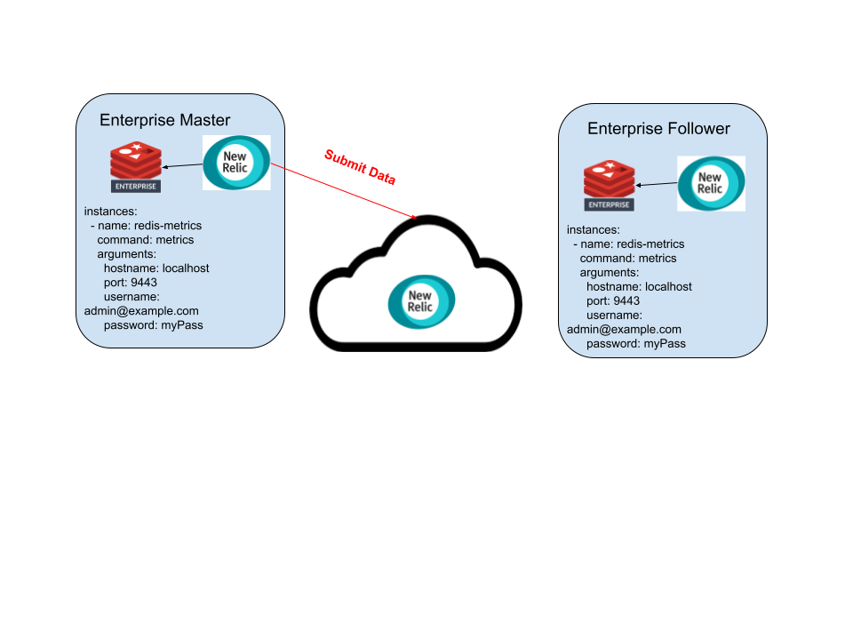
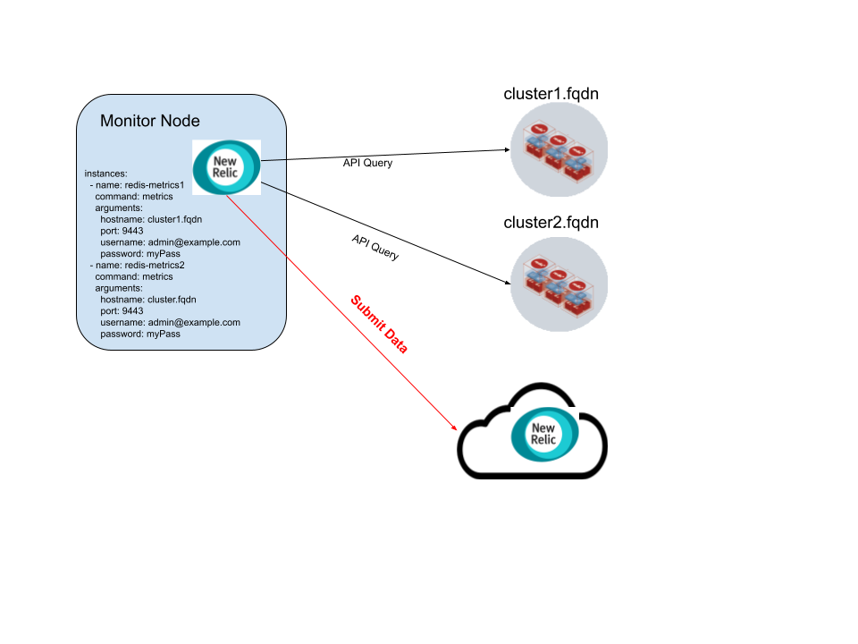
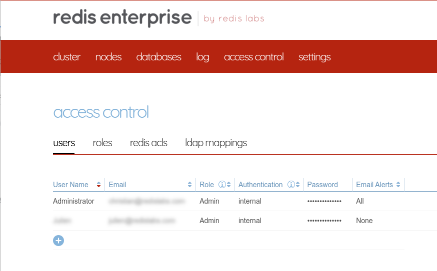
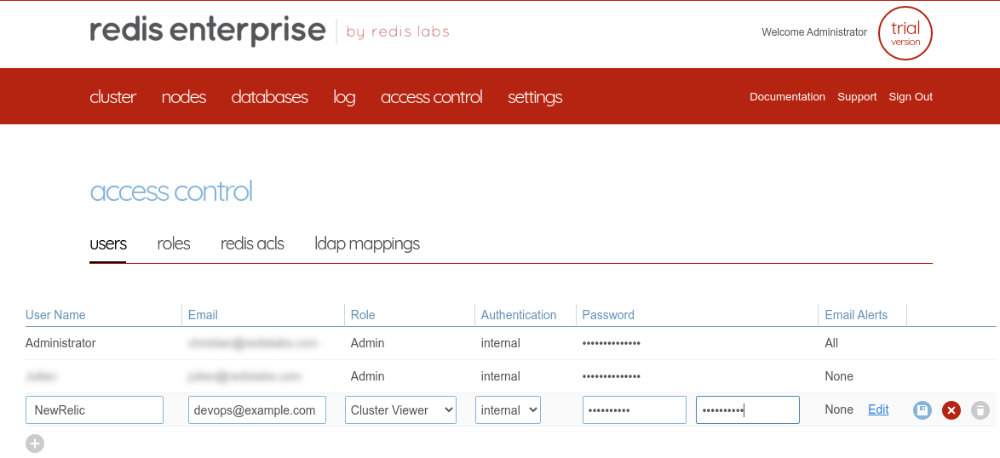
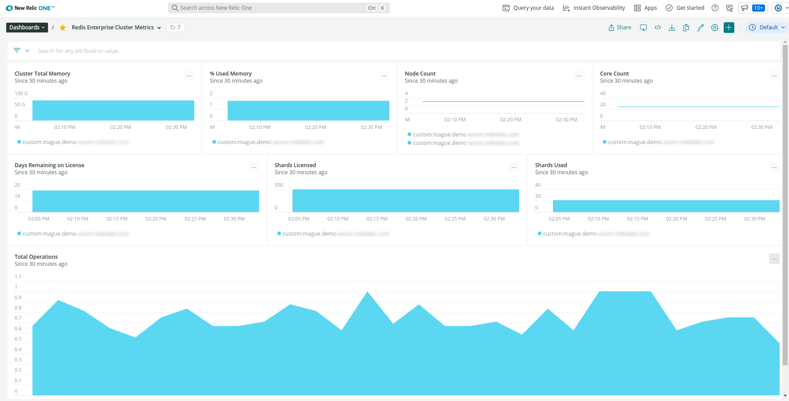
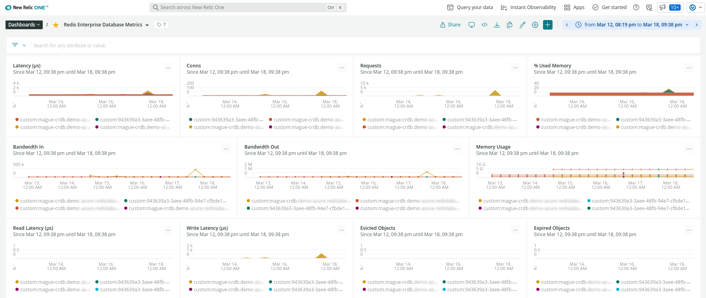
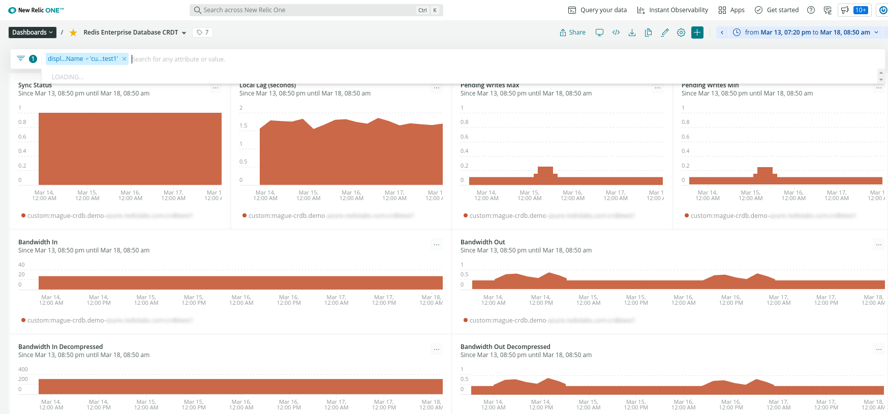

# New Relic Redis Enterprise Plugin 


This integration is geared towards self-hosted Redis Enterprise clusters and not Redis hosted cloud or various marketplace Redis Enterprise offerings.

## Plugin Architecture

Redis Enterprise plugin can be run in two modes

#### Localhost Mode

This is the preferred method of installation as it will also provide host level OS statistics for better correlation.




Sample config

```
instances:
  - name: redis-metrics
    command: metrics
    arguments:
      hostname: localhost
      port: 9443
      username: devops@example.com
      password: myPass

```

#### Cluster Mode

The New Relic agent on a node outside of the Redis Enterprise cluster can scrape multiple clusters for metrics



Sample config

```
instances:
  - name: redis-metrics1
    command: metrics
    arguments:
      hostname: cluster1.fqdn
      port: 9443
      username: devops@example.com
      password: myPass
  - name: redis-metrics2
    command: metrics
    arguments:
      hostname: cluster.fqdn
      port: 9443
      username: devops@example.com
      password: myPass

```

## Installing the plugin

#### Create a monitoring account on your Redis Enterprise

Login to your Redis Entprise Instance and click on Access Control

If you have LDAP enabled you can use LDAP, but an internal account is highly recommended.




#### Add a new user account with Cluster View Permissions




#### Ensure New Relic agent is installed and running

[Agent installation instructions](https://docs.newrelic.com/docs/infrastructure/install-infrastructure-agent/get-started/install-infrastructure-agent/)


Check the service status

```
sudo service newrelic-infra status -l

# OR depending on your Linux distro

sudo /bin/systemctl status  -l newrelic-infra.service
```


#### Pull the rlease from Github Releases

https://github.com/redis-field-engineering/newrelic-redis-enterprise/releases


#### Unarchive

```
sudo su -
mkdir -p /tmp/nr_install
cd /tmp/nr_install
wget $RELEASE_DOWNLOAD
tar zxvf *.tar.gz 
```

#### Copy files into place

```
mkdir -p /var/db/newrelic-infra/custom-integrations/bin
cp newrelic-redis-enterprise /var/db/newrelic-infra/custom-integrations/bin
cp conf/redis-redisenterprise-definition.yml /var/db/newrelic-infra/custom-integrations/
cp conf/redis-redisenterprise-multi-config.yml.example conf/redis-redisenterprise-multi-config.yml
```

#### Configure the integration

```
vi conf/redis-redisenterprise-multi-config.yml
mv conf/redis-redisenterprise-multi-config.yml /etc/newrelic-infra/integrations.d/redis-redisenterprise-config.yaml
```

Configuration parameters

| Parameter | Usage | Notes |
|--|--|--|
|hostname| FQDN of the Redis Cluster | If running in localhost mode use ```localhost``` |
|port| Port of the Redis Enterprise API | default port is ```9443``` |
|username| User created above | is an email address like ```devops@example.com``` |
|password| Password created above |  |

You can test your username/password combination with curl

```
curl -vk -u devops@example.com:password  https://CLUSTER.FQDN:9443/v1/cluster
```


#### Restart New relic

```
sudo service  newrelic-infra  restart
```

#### Install Dashboards

Go to the [dashboards section](https://one.newrelic.com/dashboards) of your New Relic installation

Click on Import Dashboards and import the following dashboards

- [Redis Enterprise Cluster Metrics](dashboards/cluster.json)
- [Redis Enterprise Database Metrics](dashboards/db.json)
- [Redis Enterprise Active/Active Metrics](dashboards/active_active.json)


### Dashboards

#### Cluster Metrics

#### Database Metrics

#### Active/Active Metrics
