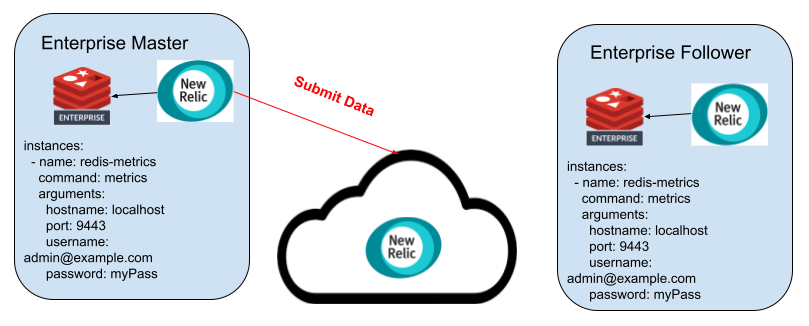
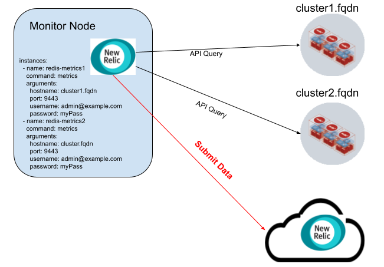

# New Relic Redis Enterprise Plugin 


## Plugin Architecture

Redis Enterprise plugin can be run in two modes

#### Localhost Mode

This is the preferred method of installation as it will also provide host level OS statistics for better correlation.




#### Cluster Mode

The New Relic agent on a node outside of the Redis Enterprise cluster can scrape multiple clusters for metrics



## Installing the plugin

#### Ensure New Relic agent is installed and running

[Agent installation instructions](https://docs.newrelic.com/docs/infrastructure/install-infrastructure-agent/get-started/install-infrastructure-agent/)


Check the service status

```
sudo service newrelic-infra status -l

# OR depending on your Linux distro

sudo /bin/systemctl status  -l newrelic-infra.service
```


#### Pull the rlease from Github Releases

https://github.com/redis-field-engineering/newrelic-redis-enterprise/releases


#### Unarchive

```
sudo su -
mkdir -p /tmp/nr_install
cd /tmp/nr_install
wget $RELEASE_DOWNLOAD
tar zxvf *.tar.gz 
```

#### Copy files into place

```
mkdir -p /var/db/newrelic-infra/custom-integrations/bin
cp newrelic-redis-enterprise /var/db/newrelic-infra/custom-integrations/bin
cp conf/redis-redisenterprise-definition.yml /var/db/newrelic-infra/custom-integrations/
cp conf/redis-redisenterprise-multi-config.yml.example conf/redis-redisenterprise-multi-config.yml
```

#### Configure the integration

```
vi conf/redis-redisenterprise-multi-config.yml
mv conf/redis-redisenterprise-multi-config.yml /etc/newrelic-infra/integrations.d/redis-redisenterprise-config.yaml
```

#### Restart New relic

```
sudo service  newrelic-infra  restart
```

#### Install Dashboards

Go to the [dashboards section](https://one.newrelic.com/dashboards) of your New Relic installation

Click on Import Dashboards and import the following dashboards

- [Redis Enterprise Cluster Metrics](dashboards/cluster.json)
- [Redis Enterprise Database Metrics](dashboards/db.json)
- [Redis Enterprise Active/Active Metrics](dashboards/active_active.json)